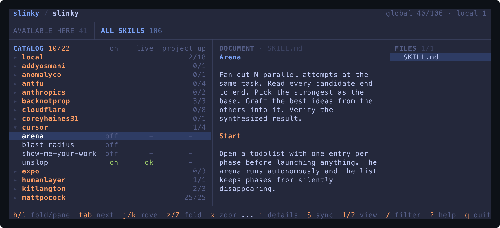

# Slinky

```text
skills host                          global agent stores
├─ skills/              ┐            ~/.agents/skills/
├─ vendor/              ├─ slinky ─> ~/.claude/skills/
└─ skills.manifest.json ┘            project-local skills
```

Slinky keeps your coding-agent skills in one versioned repository and reconciles them into the global stores agents read from. Skills you write live in `skills/`; skills you pull from others are vendored under `vendor/` with their upstream provenance, so they can be updated, diffed, and shared across machines through git.

## Install

```bash
npm install --global @gcavanunez/slinky
npx skills add gcavanunez/slinky --skill slinky --global --yes   # the agent-facing skill
```

The npm package installs a standalone binary for macOS and glibc Linux on ARM64 and x64; Bun is not required at runtime. Archives are also attached to each [GitHub release](https://github.com/gcavanunez/slinky/releases). Slinky needs Git, `tar`, `diff`, and Node.js/`npx` on `PATH`.

## Quick start

```bash
slinky init /path/to/my-agent-skills     # record the host repo
slinky bootstrap --dry-run               # see what would change
slinky bootstrap                         # back up, materialise, verify
slinky                                   # open the TUI
```

On another machine, clone and set up in one step:

```bash
slinky bootstrap --clone=https://github.com/you/my-agent-skills.git
```

Starting from nothing? The [guide](docs/guide.md#bootstrap) shows how to create an empty host.

## Everyday use

```bash
slinky status                            # catalog, live state, drift
slinky enable <skill>                    # or disable, or profile apply <name>
slinky skills add owner/repo --skill x   # vendor a skill from skills.sh
slinky update --check                    # anything new upstream?
slinky update                            # review and accept changes
slinky sync                              # save, pull, reconcile, restore
```

`sync` is the whole loop: it commits reviewed catalog changes, pulls the upstream, rebuilds the global stores, and resets live vendor copies to the catalog. Preview it with `--dry-run`.

## The TUI

One catalog tree on the left, the selected skill's documentation on the right.



| key | does |
|---|---|
| `j/k` `h/l` | move; fold or unfold a group |
| `space` | toggle a skill, or every skill in a group from its heading |
| `z` / `Z` | fold one group / fold all |
| `/` | filter the catalog, or search the document |
| `enter` `i` | open the document / show details |
| `d` `u` | diff a drifting vendor skill / check upstream |
| `e` `a` `L` `p` | edit, index an unindexed skill, link into a project, apply a profile |
| `S` | run `slinky sync`; the tab row shows `⇣ N to pull` when the store has commits waiting |
| `t` | pick a theme (27 available, previewed live) |
| `x` `v` `<` `>` | zoom, cycle layouts, resize |
| `?` | everything else |

## How it fits together

- **Local skills** in `skills/` are symlinked into `~/.agents/skills`.
- **Vendor skills** in `vendor/` are committed baselines, copied into the store so `npx skills` can update them; `slinky update` shows you the diff before anything changes in the catalog.
- **Profiles** in the manifest are exact enabled sets. **Machine state** (`.local/state.json`, gitignored) records what's disabled here and which projects have links.
- **Project links** copy or symlink a catalog skill into another repository, excluded from that repo's git by default.

The catalog repo is yours; Slinky only owns the tooling. Save it with `slinky save`, share it with `slinky push`, and each machine's `slinky sync` keeps up.

## Documentation

- [Guide](docs/guide.md): every workflow in depth, TUI bindings, safety notes, and the full CLI reference.
- [Data contract](docs/data-contract.md): the manifest, state, lock, and config formats.
- [Slinky skill](skills/slinky/SKILL.md): what an agent reads to drive Slinky for you.

## Development

```bash
git clone https://github.com/gcavanunez/slinky.git
cd slinky
bun install
bun test
bun run typecheck
bun run build:bin          # dist/slinky for this platform
```

Bun 1.3 or newer. `bun run package:smoke` builds and installs the npm package the way a release does.

## Credits

This project draws inspiration from and utilities from:

- [ghui](https://github.com/kitlangton/ghui)
- [mail-control](https://github.com/kitlangton/mail-control)
